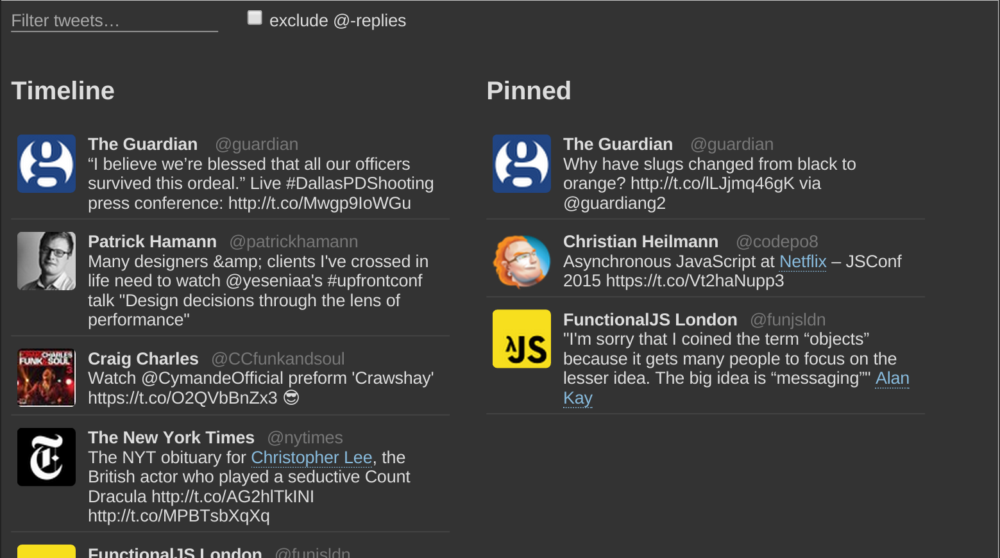

# FunctionalJS Dojo: A reactive Twitter client

In this dojo, we are going to build **a small Twitter client using the
[reactive loop](https://slides.com/theefer/reactive-loop-funjs)
pattern**.

Our client will display a live feed of tweets with simple filtering
abilities. It will also asynchronously highlight semantic entities
(places, people, etc) and allow adding tweets to a “pinned” list.




## Setup

First install the dependencies (you have NodeJS, right?):

```
$ npm install
```

Then start the local file server:

```
$ npm run start
```

Optionally, you can also run the `watch` script separately to get
LiveReload:

```
$ npm run watch
```

You should be ready to go, just hit [](http://localhost:8080) and get coding!


## Instructions

Open the `app.js` file in your favourite editor.

Tips:

1. The code is written in ES6, if anything is unclear check the docs
   or ask questions!
2. Constants or functions whose name ends in `$` (e.g. `tweets$`)
   denote observable streams, as a convention.


### 1. Live feed

Let's start by displaying a live stream of tweets in the Timeline.

You can see in the `view` function that we call the `getTweetStream$`
function to get a stream of tweets (Note: each element in the stream
is an *Array of tweets*, not a single tweet!). This stream is passed
to the `columnsComponent`, which itself passes it to the
`columnComponent`.

First, replace the dummy definition of `tweetList$` with one that
renders the `tweets$` (see `TODO [#1a]`). This should make tweets
appear under your Timeline.

Then, refactor the `tweetElement` function to use the more complete
markup (see `TODO [#2b]`). This should make tweets look nicer as in
the screenshot above.


### 2. Feed filters

At the top of the page, a form (`filtersComponent`) is displayed with
two input fields:

1. A filter query
2. An option to exclude @-replies

The components export their respective models as streams (`query$` and
`exclReplies$`). These are also references in the main `view`
function under constants of the same name.

Change the dummy definition of `filteredTweets$` in the main `view`
function to apply the `query$` and `exclReplies$` filters (see `TODO
[#2]`). Once done, you should see the Timeline change when using the
filters.


### 3. Pinned column

We want to be able to pin any tweet from the Timeline by clicking
it. Pinned tweets should appear in the Pinned column, most recently
added first.

First, in the `columnComponent`, let's update the `view$` function to
push the tweet object of any tweet element clicked onto the
`activate$` stream (see `TODO [#3a]`).  This is exposed as the
`activate$` extent, which for the timeline is translated to the `pin$`
intent on the `columnsComponent`.

Define `pinnedTweets$` in terms of the `pin$` intent (see `TODO
[#3b]`). Once completed, clicking a tweet in the Timeline column
should make it appear in the Pinned column.

Then, update the `pinnedTweets$` definition to also include the
`unpin$` intent (see `TODO [#3c]`). Once completed, clicking a tweet
in the Pinned columns will make it disappear.


### 4. Entities highlighting

Real web hipsters are also semantic nerds (believe me). So let's
highlight semantic entities in the tweets, using an external API to do
the entity extraction.

The `analyseEntities$` takes a string and returns a list of entities
asynchronously, as a stream. Call this function on each tweet before
rendering it (see `TODO [#4a]`). Then pass the returned entities as
second parameter to the `tweetElement` function and use them to
highlight the words in the tweet (see `TODO [#4b]`).


### 5. Drag to pin

Use the `mousedown`, `mousemove` and `mouseup` events as streams to
allow dragging tweets from the Timeline to the Pinned column to pin
them.

I've not actually tried that one, so good luck :-)


## Useful references

- [Rx.Observable API documentation](https://github.com/Reactive-Extensions/RxJS/blob/master/doc/api/core/observable.md)
- [virtual-dom repository](https://github.com/Matt-Esch/virtual-dom)
- [Slides for the Reactive Loop talk](https://slides.com/theefer/reactive-loop-funjs)
- [Source code for the live demo](https://github.com/theefer/talk-reactive-loop/tree/master/demo)
- [Real-world example: grid-inspector](https://github.com/guardian/grid-inspector)
- [Seminal blogpost “Reactive MVC and the Virtual DOM”](http://futurice.com/blog/reactive-mvc-and-the-virtual-dom)
